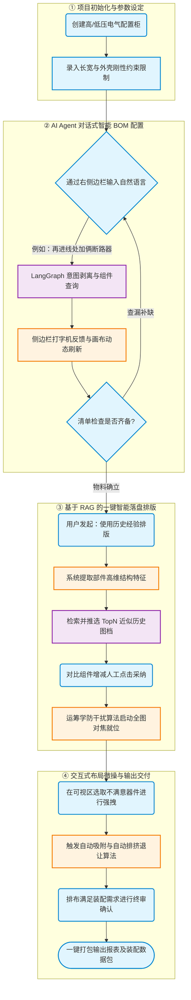
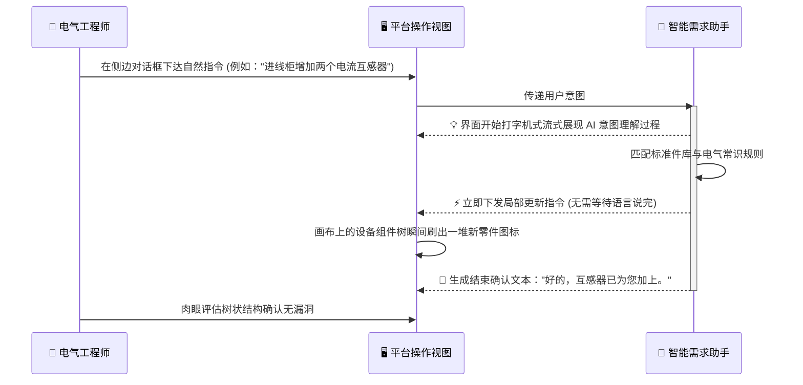
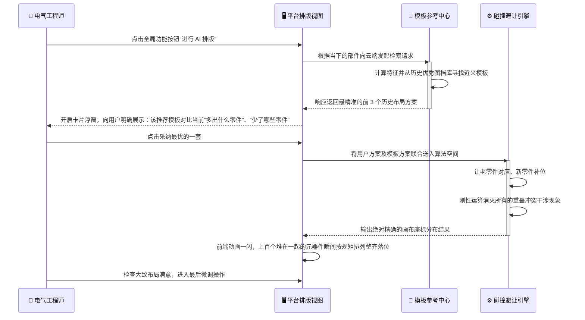
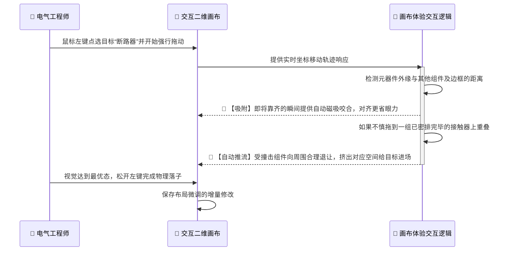

# Layout-RAG 智能辅助设计平台：产品交互流程图

本文档面向业务和产品团队，展示电气工程师在使用本平台时经历的主业务动线与交互链路。去除了底层复杂的技术与接口时序，主要聚焦于**用户动作（User Action）**与**系统反馈（System Feedback）**的体验闭环。

## 1. 业务全景操作主干线

展示了用户从新建项目到最终完成图纸输出的全生命周期主线流程。我们将整个长链路业务操作划分为四个极为清晰的体验段落：**项目起步 -> 对话式配置 -> AI 接管排版 -> 人工柔性定稿**。

 

## 2. 交互场景 1：AI 工具箱对话配置元器件

此流程详述了用户在右侧栏通过自然对话，完成高门槛元器件清单配置的业务动作。

 

## 3. 交互场景 2：基于沉淀图档的智能排版

此页面描述一旦清单“配齐”，系统如何调用沉淀图纸库帮用户完成初始布局。

 

## 4. 交互场景 3：排版画布上的微操感体验

本流程展现当系统排出版面后，由于现场接线习惯或业主私人要求，人工需要介入的畅快操作体验。

