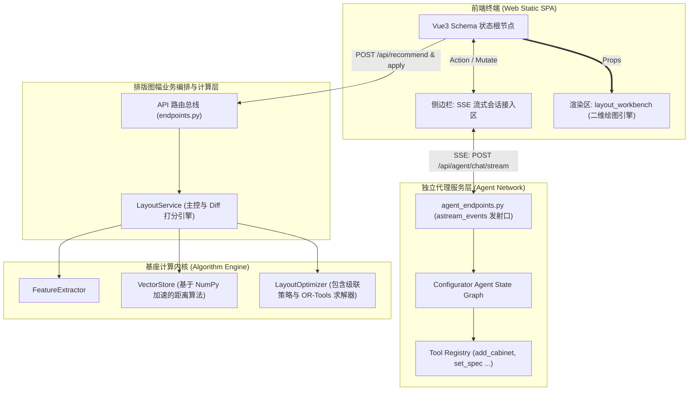

# Layout-RAG 智能辅助设计平台：核心系统架构图

通过剥离前端表现、智能体意图识别与硬核图面算法引擎，系统呈现出一个职责极为清晰的领域驱动架构（DDD）。下面为核心模块层级结构图。

## 1. 软件逻辑架构拓扑 (Logical Architecture)

## 2. 关键组件剖析与架构意图

### A. 基于状态图框架的 Configurator Agent
相比于直连大模型的传统思路，本系统依托 `LangChain / LangGraph` 实现了更为受控的运行时循环。
- **状态维护**：系统在后端维护包含 `current_schema` 与 `selection` 的 Context 运行状态，保证 Agent 的每一个修改提议都是基于当下面板真实数据的。
- **Tool Calling 执行器**：所有影响视图状态的逻辑全部包裹为 `Agent Tool`，利用 `astream_events` 解析 `on_tool_end` 生命周期回调实现快速通知。

### B. 特征空间抽取器 (Feature Extractor) 与 Local RAG
由于工程排版的特殊性，相似度的界定标准往往在于“面板有多大”和“某些特定元件出现了几个”。
- **动态列联表架构**：引擎摒弃了写死字段的方式，在扫描 `templates/` 下的历史图纸时，能够捕捉所有未知的 `part_type` 自动生成动态伸缩的特征宽表向量集，并采用离线 `npy` 格式固化，大幅消除向量库系统的运维开销。

### C. 布线图解优化器 (Layout Optimizer) 的四阶降维思想
工业二维排版的变量空间极大，纯利用求解器会消耗巨大算力导致接口超时。项目通过精巧的架构在前期完成降维：
- **前置约束收敛**：业务层先由 `LayoutOptimizer` 通过欧氏距离锁定模板坐标，再进行`_match_parts` (部件按类型配对) 到 `_assign_cursor_target` (缺件按行游标铺设)。
- **最后的一公里兜底**：待所有坐标均有了一个理想的“基准靶点 (target)”后，最后传入基于 `cp_model.CpModel()` 的规划器，仅对干涉区域进行 L1 加权偏差计算推移，使得整个优化求解流程的体量控制在上百毫秒级别。
