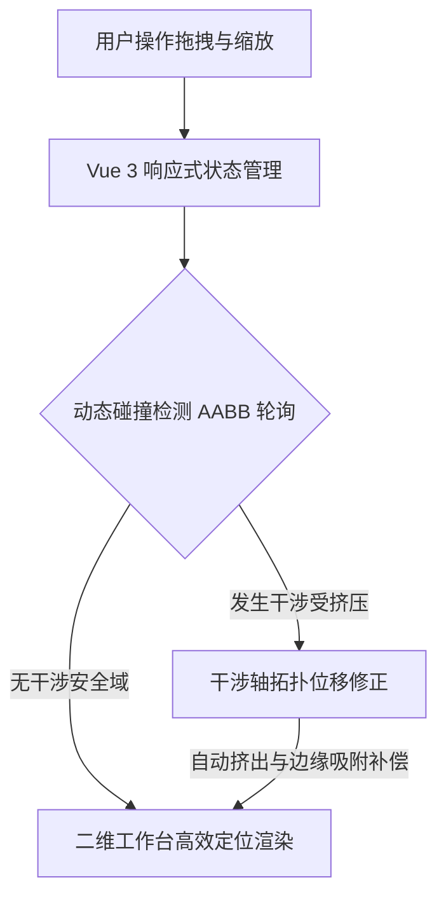
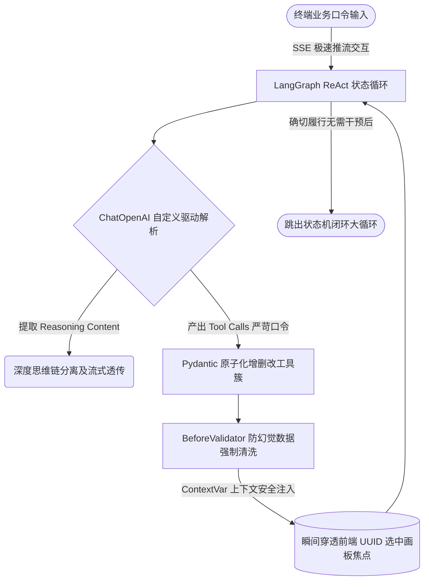
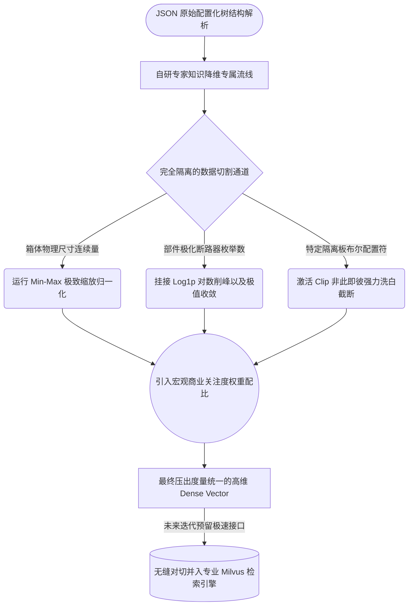
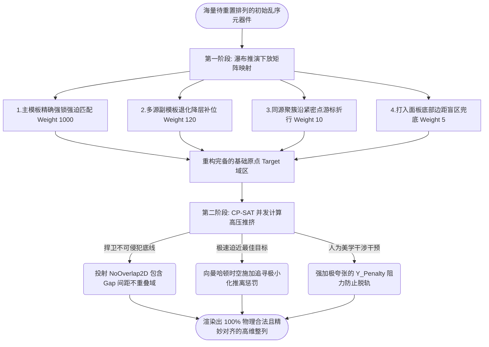

# Layout-RAG 智能辅助设计平台：关键技术选型与工程考量

系统并非是各类市面火爆的 AI 概念叠加，而是极度克制地选择了特定纯净底座以解决高低压柜自动排版中的特定难题。以下是经过慎重论证的关键选型清单。

## 1. 前端技术栈与交互引擎

### A. 视图框架：Vue 3 与响应式状态管理

**选型原因**：系统的交互包含复杂的聊天面板与重度数据绑定的二维编辑器，需要对共享状态（如选中的部件、当前的方案数据）进行高强度的双向通信同步。
**选型决定**：采用 Vue 3 作为总控前端架构。利用 Vue 灵活的组件化机制与响应式 Proxy，我们可以高效地在流式对话侧边栏与渲染视图区域之间实现无缝状态传递与视图重绘更新控制。

### B. 布局编辑器、碰撞检测与自动挤出

**选型原理**：二维排版核心在于提供符合人类直觉且符合物理干涉约束的推演画板，而非一个静态图像。
**核心实现**：

- **二维工作台 (`layout_workbench`)**：封装和实现定制的独立图形渲染系统交互区，负责承载海量高低压柜元器件的高刷渲染与空间位置标定。
- **动态碰撞检测 (Collision Detection) 与自动挤出 (Auto-Extrusion)**：为提高人为设计的效率，平台拒绝死板的强制报错机制。前端底层通过 AABB 等算法持续进行轮询。当拖拽组件相互挤压或放入拥挤的轨道时，系统会基于干涉轴动态进行拓扑位移修正（“自动挤出”及“边缘吸附/Snapping”），像“推箱子”一样平滑解决部件间的空间冲突，从而彻底消除微距像素重叠对工程师造成的校准痛苦。

## 2. 智能体 (Agent) 技术栈

系统并未采取极其松散且毫无约束的简单对话链，而是深度结合业务逻辑打造了专属的**工业场景结构化 Agent 底座**。

### A. 基于 LangGraph 的 ReAct 拓扑与思维穿透 (Reasoning Extraction)

**状态机架构**：依托 LangGraph 构建了带有持久化内存（`InMemorySaver`）的确定性流转状态机（ReAct 模式）。大模型在推理节点（`agent`）与工具节点（`tools`）间反复拉锯判定，直到彻底确信用户的物理配置变更已被全量覆盖且无需再下发指令时，才会路由至 `END` 节点退出，构筑了高强度的自我校验闭环。
**思维流穿透**：鉴于工业选型往往带有极其复杂的上下文推演过程，系统在底层专门覆写了 LangChain 的 `ChatOpenAI` 驱动卡（通过介入 `_convert_chunk_to_generation_chunk` 响应流方法），独家打通了最新一代推理大语言模型（如 Qwen / DeepSeek）的 `reasoning_content`。从而直接萃取出模型的私有思维链下行，做到了让模型面对重型图纸配置时不仅“干得坚决”，底层的“谋划过程”更为全盘透明。

### B. 上下文绑定 (ContextVar) 与 Pydantic 原子级工具簇

**状态穿透无断点**：工程师的口令中极易出现“把开关加到当前这里”、“修改这个面板高度”等模糊代词。为彻底解决代词地雷，网络层利用 Python 协程安全的 `ContextVar` 实现超低延时状态注水。底层工具函数（例如 `get_current_selection`）被调用时可瞬间穿透读取前端界面的 UUID 画板焦点映射矩阵，彻底告别盲点乱操作。
**工具簇微观管束**：为了抑制大模型极易产生的幻觉，Agent 完全摒弃了让模型直出数万行巨大 JSON 结构谱的疯狂要求。转而提供极为克制、拆分至最小粒度的原子操作宏（如 `add_cabinets` / `edit_panel` / `add_parts`）。更精妙的是，平台重度引入了 `Pydantic Schema` 中的 `BeforeValidator` 预清洗钩子与 `StrEnum` 强验证拦截，将大量的备板尺寸推测（如宽未指定时基于 `柜体模数` 进行回退）、错误分类洗白强行压入最底层验证数据流。从入口处直接“封死”了非法规格涌入布局系统的可能性。

## 3. 特征向量提取与检索相关技术

### A. 基于专家经验的结构化特征降维空间 (Feature Extractor)

**选型与重构动机**：在低压电气配电柜设计中，图纸本身完全由高度结构化的物理属性构成，极度依赖于电气参数、面板尺寸与特定开关类目的枚举组合匹配，几乎不包含开放式长文本意图。因此，传统的通用大语言模型文本 Embedding （如 BERT 等）特征在工业图纸排版检索中不仅算力开销极大，更会直接丢失原本精准的几何边界与强硬的电气业务关联规则。
**核心工程落地**：果断摒弃“万物皆可深度学习大模型 Embedding”的盲目方案，转向构建极度贴合工业场景的轻量级特征探针流线。探针通过解析柜体原始文档树与部件字典，精准提取出三类决定排版成败的核心专家特征：
1. **连续物理量**（箱体尺寸参数、坐标、内部构件外包盒尺度等）；
2. **离散统计量**（各类断路器 `part_type` 的搭载数量、母排频次等）；
3. **布尔状态量**（进线/出线配置逻辑、绝缘挡板等特殊标识）。
这套由手工特征工程打造的流水线，等同于数字化复刻了资深电气工程师“扫一眼图纸就知道怎么排”的天然焦点。成功将体积极大且嵌套繁冗的 JSON 配电图蓝图，浓缩降维成了极具抗噪性、计算极快且物理涵义完全透明的领域特征库。

### B. 异构特征的分组隔离与归一化机制

**痛点分析**：提取出的特征是由“柜内各类型开关数量”（计数类特征）、“外包框尺寸等空间物理量”（连续型特征）与“是否包含特定功能块”（布尔型特征）等物理涵义完全不同的异构数据组成。如果直接用于检索计算欧氏距离，尺度极大的物理参数将会彻底吞噬其他数量或布尔特征的权重。
**机制实现**：为了解决异构标尺导致的权重失效，提升特征之间的平等检索表达，并且方便未来向更专业的向量检索引擎平滑演进，系统将特征数据划分为三组，在向量化构建时执行了完全隔离的数值归一化处理：

- **连续型特征（Continuous, 如尺寸/包围框）**：采用 Min-Max 归一化（Min-Max Scaling），将各维度的数值严格压缩至 `[0, 1]` 区间范围内。
- **计数型特征（Count, 如各类元器件频次）**：采用 Log1p（对数平滑）并辅以最大值缩放（Max Scaling），对于存在极端长尾数量波动的统计型指标起到收敛效果，最终同样映射至 `[0, 1]` 区间。
- **布尔型特征（Boolean, 状态位等）**：采用向下/向上强制逼近（Clip 截断）操作至 `[0, 1]`，以彻底洗去原始提取时可能产生的非二值噪音干涉。
最终，所有处于相纲下的特征群再叠加预设好的关注点融合权重（Weights），从而在距离累加计算（加权平方欧氏距离，Weighted Squared Euclidean Distance）中获得公平表现，极大抑制了特征由于天然取值尺度差异造成的距离计算坍塌。

## 4. 约束求解器与排版算法技术

平台完全摒弃了依赖大语言模型盲目生成预测坐标的脆弱方案，也放弃了由于缺乏绝对边界掌控力极易翻车的启发算法（如遗传算法），而是自研构建了**“基于四维梯级模板映射 + CP-SAT 刚性约束突围”** 的两步走混合驱动引擎（LayoutOptimizer）。

### A. 阶段一：极速降维的模板期望映射 (Target Generation)

**痛点解算**：若将海量待排元器件丢向物理跨幅极广的全空背板，CP-SAT 会瞬间跌入阶乘爆炸级的搜算陷阱，引发崩溃宕机超时。
**策略落地**：为了极限压缩运筹学的盲搜域，系统于第一阶段巧妙引入了四级瀑布流权重衰减映射（Confidence Weight Array），根据各类图纸提供预置定海神针坐标：
1. **主模板精确强锁定（权重 1000）**：利用贪心策略强行吸附同型 `part_type` 与相似宽高比面板的元部件，执行绝对刚性的等比例主控追踪。
2. **多源模板降维补位（权重 120）**：若主件图集残次，自动触发副系备选模板的类型下接进行残板复原锚定。
3. **同源聚簇游标折行（权重 10）**：若属于新增批量件扩容，采用沿着相同类型密集锚点自动追尾的游标续排（支持饱和边缘溢出后垂直换行）。
4. **兜底无援（权重 5）**：强制压入面板底安全池域。
依靠这种阶梯型工程学常识重构机制将 RAG 推理发挥到极致，实现了非随机起步的原点控制。

### B. 阶段二：整数规划求解与 Y 轴重力偏置 (Constraint Optimization)

**绝对硬边界不可突破**：“任何两个接线元件绝不能存在即便是 1mm 的空间咬合”。针对这等零容忍的物理法则壁垒，只有经典运筹学 `Google OR-Tools (CP-SAT)` 才能给到 100% 绝对安全不返工的坚实承诺。
**物理数学转化模型**：
- **底线性命**：平台全面下放底层干涉限制 `model.AddNoOverlap2D()` 并对每一个边缘引入避障间隔（Margin 与 Gap）确保非穿透矩形间隙合法化。
- **目标追寻（极速推箱子）**：向约束空间声明加权曼哈顿距离拉平目标：`Minimize ∑ weight_i * (|x_i - tx_i| + y_penalty * |y_i - ty_i|)` 寻求总体偏离最小化。
- **美学偏置惩罚 (Y_Penalty)**：尤其出彩的是，优化引擎对于坐标在 Y 轴的流转施加了高倍的纵向极性阻力（`y_penalty` 默认10倍以上）。当遭遇极其紧缺冲突的布局时，求解器在惩罚力驱动下本能倾向往水平轨道（同行）滑移疏解。这种设计极为有效地让同一行的开关能够对齐在一根横轴水准线上，最大限度从算法基层还原了工业布线的齐整美观！

### C. 演进规划：可插拔的业务排布规则与知识矩阵深化 (Business Rules Integration)

**后续深化方向**：虽然当前的“四级模板映射 + CP-SAT 干涉与推移兜底”机制已经足以解决绝大部分通用的空间重构难题，但电气成套装备针对不同细分业务（如低压抽屉柜、高压中置柜、重载变频柜）仍伴随着高度定制且不可违逆的技术“潜规则”。
**落地拓展路径**：得益于 `LayoutOptimizer` 在架构设计上高度解耦了策略映射与底层数学求解的过程，系统已预留了丰富的领域规则接入卡槽，未来计划通过以下维度持续深化演进：
1. **特定领域硬性约束（Hard Constraints）的植入**：将“大功率发热元器件四周必须保留特定宽幅散热风道”、“强弱电元器件必须在 Y 轴或不同隔断实行严格隔离（强弱电禁跨）”等行业禁忌，无缝转化为 CP-SAT 可强解的多目标非重叠惩罚域。
2. **基于商业降本的自适应软性权重**：针对排版中的“进出线母排路径敷设最短（节省纯铜物料）”、“机柜整体受力抗震重心均衡”等高级需求，提供更为立体的目标追寻机制，通过动态扩充多维度函数惩罚量（Cost Weights），引导求解器探寻最具经济学视角的空间解。
3. **专家经验引擎驱动**：配合大模型推理的不断深化，支持不同工厂能够以声明式的方式随时挂载或抽离特定产品线的国标规范约束，最终从单一“几何抄绘避障平台”彻底蜕变为“全自驱的正向工程设计大脑”。

