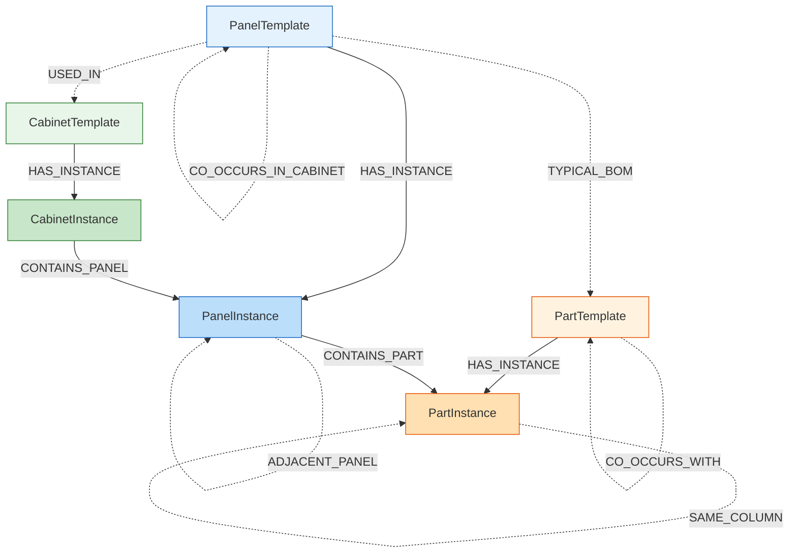

# 低压开关柜 Neo4j 图数据库结构报告

> 生成时间：2026-04-27 | 数据源：`schema_1775637254389.json` + `schema_1775640845490.json`  
> 数据库：`lowvoltagecabinet` @ `neo4j://127.0.0.1:7687`

---

## 一、图模型总览



| 统计项 | 数量 |
|--------|------|
| 节点总数 | **199** |
| 关系总数 | **828** |
| 数据来源 | 2 个 schema 文件 → 8 个柜体 → 43 个面板 → 112 个元件 |

---

## 二、节点定义

### 2.1 CabinetTemplate（柜体模板）— 4 个

去重键：`cabinet_use + cabinet_model`

| 属性 | 类型 | 说明 | 示例 |
|------|------|------|------|
| `template_key` | str | 唯一键 `{use}\|{model}` | `进线柜\|GCK` |
| `name` | str | 显示名称 = 柜用途 | `进线柜` |
| `cabinet_use` | str | 柜用途 | `进线柜` / `出线柜` / `母联柜` / `电容补偿柜` |
| `cabinet_model` | str | 柜型号 | `GCK` |

### 2.2 CabinetInstance（柜体实例）— 8 个

| 属性 | 类型 | 说明 | 示例 |
|------|------|------|------|
| `cabinet_id` | str | UUID 唯一标识 | `ba25b025-...` |
| `name` | str | 显示名称 = `{用途}-{编号}` | `进线柜-1A1` |
| `cabinet_name` | str | 柜编号 | `1A1` |
| `cabinet_use` | str | 柜用途 | `进线柜` |
| `cabinet_model` | str | 柜型号 | `GCK` |
| `width` | int | 柜体宽度 (mm) | `800` |
| `height` | int | 柜体高度 (mm) | `2200` |
| `depth` | int/null | 柜体深度 (mm) | `1000` |
| `wiring_method` | str | 接线方式 | `上进上出` |
| `source_file` | str | 来源文件名 | `schema_1775637254389.json` |

### 2.3 PanelTemplate（面板模板）— 10 个

去重键：`panel_type + operation_method`

| 属性 | 类型 | 说明 | 示例 |
|------|------|------|------|
| `template_key` | str | 唯一键 | `断路器面板\|抽出式` |
| `name` | str | 显示名称 = 面板类型 | `断路器面板` |
| `panel_type` | str | 面板类型 | `断路器面板` / `抽屉面板` / `下门板` / ... |
| `operation_method` | str | 操作方式 | `抽出式` / `固定式` / `抽屉式` |

### 2.4 PanelInstance（面板实例）— 43 个

| 属性 | 类型 | 说明 | 示例 |
|------|------|------|------|
| `panel_id` | str | UUID 唯一标识 | `8cc8572a-...` |
| `name` | str | 显示名称 `{类型}-{宽}x{高}` | `断路器面板-800x700` |
| `panel_type` | str | 面板类型 | `断路器面板` |
| `size_w` | int | 面板宽度 (mm) | `800` |
| `size_h` | int | 面板高度 (mm) | `700` |
| `operation_method` | str | 操作方式 | `抽出式` |
| `position_x` | int | 在柜体中的 X 坐标 | `0` |
| `position_y` | int | 在柜体中的 Y 坐标 | `300` |
| `order_val` | int | 排列顺序 | `1` |
| `main_circuit_current` | int/null | 主回路电流 (A) | `3200` |
| `main_circuit_poles` | int/null | 主回路极数 | `3` |
| `source_file` | str | 来源文件 | `schema_1775640845490.json` |
| **feat_total_parts** | int | 元件总数 | `9` |
| **feat_unique_types** | int | 元件种类数 | `4` |
| **feat_total_parts_area** | float | 元件总面积 (mm²) | `176095` |
| **feat_fill_ratio** | float | 填充率 | `0.314` |
| **feat_panel_aspect_ratio** | float | 面板宽高比 | `1.143` |
| **feat_avg_part_width** | float | 元件平均宽度 | `72.3` |
| **feat_avg_part_height** | float | 元件平均高度 | `78.6` |
| **feat_max_part_width** | float | 最大元件宽度 | `376` |
| **feat_max_part_height** | float | 最大元件高度 | `432` |
| **feat_large_part_ratio** | float | 大型元件比例 (>10000mm²) | `0.111` |
| **feat_main_circuit_current** | float/null | 主回路电流特征 | `3200.0` |

> [!NOTE]
> 带 `feat_` 前缀的属性为推荐用特征，参考自 `feature_extractor.py`，用于面板相似度比较。

### 2.5 PartTemplate（元件模板）— 22 个

去重键：`part_type + part_model`

| 属性 | 类型 | 说明 | 示例 |
|------|------|------|------|
| `template_key` | str | 唯一键 | `万能式断路器\|NXA-4000/3P` |
| `name` | str | 显示名称 `{类型}({型号})` | `万能式断路器(NXA-4000/3P)` |
| `part_type` | str | 元件类型 | `万能式断路器` |
| `part_model` | str | 元件型号 | `NXA-4000/3P` |
| `size_w` | int | 元件宽度 (mm) | `570` |
| `size_h` | int | 元件高度 (mm) | `438` |

### 2.6 PartInstance（元件实例）— 112 个

| 属性 | 类型 | 说明 | 示例 |
|------|------|------|------|
| `part_id` | str | UUID 唯一标识 | `796fef13-...` |
| `name` | str | 显示名称 | `指示灯-实例` |
| `position_x` | int | 面板内 X 坐标 (mm) | `115` |
| `position_y` | int | 面板内 Y 坐标 (mm) | `296` |
| `rotation` | int | 旋转角度 | `0` |

---

## 三、关系定义

### 3.1 层级关系

| 关系 | 方向 | 数量 | 属性 | 说明 |
|------|------|------|------|------|
| `HAS_INSTANCE` | Template → Instance | 163 | — | 模板实例化（柜/面板/元件通用） |
| `CONTAINS_PANEL` | CabinetInstance → PanelInstance | 43 | `order_val`, `position_x`, `position_y` | 柜体包含面板，带排列顺序和坐标 |
| `CONTAINS_PART` | PanelInstance → PartInstance | 112 | — | 面板包含元件 |

### 3.2 空间拓扑关系（元件级）

| 关系 | 方向 | 数量 | 属性 | 判定条件 |
|------|------|------|------|---------|
| `ADJACENT_TO` | PartInstance ↔ PartInstance | 138 | `distance`, `direction`, `h_gap`, `v_gap` | 中心距 ≤ 150mm |
| `SAME_ROW` | PartInstance ↔ PartInstance | 176 | `y_diff`, `direction`, `h_gap` | Y 差 ≤ 30mm |
| `SAME_COLUMN` | PartInstance ↔ PartInstance | 33 | `x_diff`, `direction`, `v_gap` | X 差 ≤ 30mm |

> **说明**：
>
> - `direction`：相对方向，包含 `left`, `right`, `above`, `below`。
> - `h_gap` / `v_gap` (mm)：分别表示水平和垂直方向的边到边(Bounding Box)间距，最小为 0。

### 3.3 空间拓扑关系（面板级）

| 关系 | 方向 | 数量 | 属性 | 判定条件 |
|------|------|------|------|---------|
| `ADJACENT_PANEL` | PanelInstance → PanelInstance | 47 | `gap`, `direction`, `x_overlap`, `y_overlap` | 边到边间距 ≤ 50mm |

> **说明**：
>
> - 面板支持两种排布关系：
>   1. **上下堆叠** (`direction='below'`)：检测 X 轴有重叠 (`x_overlap > 0`) 且 Y 轴间距 ≤ 50mm。
>   2. **左右并排** (`direction='right'`)：检测 Y 轴有重叠 (`y_overlap > 0`) 且 X 轴间距 ≤ 50mm。

### 3.4 统计/推荐关系

| 关系 | 方向 | 数量 | 属性 | 说明 |
|------|------|------|------|------|
| `CO_OCCURS_WITH` | PartTemplate ↔ PartTemplate | 47 | `weight`, `panel_types` | 元件在同面板中共现，带面板类型 |
| `CO_OCCURS_IN_CABINET` | PanelTemplate ↔ PanelTemplate | 18 | `weight`, `cabinet_use`, `cabinet_model` | 面板在同柜体中共现 |
| `USED_IN` | PanelTemplate → CabinetTemplate | 18 | — | 面板-柜体关联 |
| `TYPICAL_BOM` | PanelTemplate → PartTemplate | 33 | `avg_qty`, `min_qty`, `max_qty`, `sample_count` | 典型元件数量统计 |

---

## 四、柜体 → 面板组合详情

```
进线柜-1-1AA1 (1200×2200mm)
  ├─ y=0    框架面板-1200x300
  ├─ y=300  断路器面板-1200x800
  ├─ y=1100 下门板-1200x1000
  └─ y=2100 框架面板-1200x100

进线柜-1A1 (800×2200mm)
  ├─ y=0    框架面板-800x300
  ├─ y=300  断路器面板-800x700
  ├─ y=1000 下门板-800x1100
  └─ y=2100 框架面板-800x100

母联柜-1A2 (800×2200mm)
  ├─ y=0    框架面板-800x300
  ├─ y=300  断路器面板-800x700
  ├─ y=1000 下门板-800x1100
  └─ y=2100 框架面板-800x100

电容补偿柜-1-1AA2 (1000×2200mm)
  ├─ y=0    框架面板-1000x300
  ├─ y=300  上门板-1000x400
  ├─ y=700  中门板-1000x400
  ├─ y=1100 下门板-1000x1000
  └─ y=2100 框架面板-1000x100

电容补偿柜-1A3 (800×2200mm)
  ├─ y=0    框架面板-800x300
  ├─ y=300  断路器面板-800x400
  ├─ y=700  下门板-800x1400
  └─ y=2100 框架面板-800x100

出线柜-1-1AA5 (800×2200mm)
  ├─ y=0    框架面板-800x300
  ├─ y=300  断路器面板-800x800
  ├─ y=1100 抽屉面板-600x400 + 占位面板-200x1000（并排）
  ├─ y=1500 抽屉面板-600x200
  ├─ y=1700 抽屉面板-600x200
  ├─ y=1900 抽屉面板-600x200
  └─ y=2100 框架面板-800x100

出线柜-1A6 (800×2200mm)
  ├─ y=0    框架面板-800x300
  ├─ y=300  断路器面板-800x600
  ├─ y=900  断路器面板-800x600
  ├─ y=1500 断路器面板-800x600
  └─ y=2100 框架面板-800x100

出线柜-1A7 (800×2200mm)
  ├─ y=0    框架面板-800x300
  ├─ y=300  抽屉面板-600x300 ×6 + 框架面板-200x1800（并排）
  └─ y=2100 框架面板-800x100
```

---

## 五、面板元件组合详情（TYPICAL_BOM）

```text
断路器面板
  ├─ 指示灯 [平均: 5.0个 | 范围: 5-5 | 样本数: 5]
  ├─ 多功能表 [平均: 1.25个 | 范围: 1-2 | 样本数: 4]
  ├─ 万能式断路器(NDW2-20-12-3P) [平均: 1.0个 | 范围: 1-1 | 样本数: 3]
  ├─ 万能式断路器(NDW2-32-32A-3P) [平均: 1.0个 | 范围: 1-1 | 样本数: 2]
  └─ 按钮开关 [平均: 1.0个 | 范围: 1-1 | 样本数: 2]

抽屉面板
  ├─ 指示灯 [平均: 2.0个 | 范围: 2-2 | 样本数: 6]
  ├─ 塑壳式断路器(NDM3E-630-3P) [平均: 1.0个 | 范围: 1-1 | 样本数: 6]
  └─ 多功能表 [平均: 1.0个 | 范围: 1-1 | 样本数: 6]

下门板
  ├─ 指示灯 [平均: 8.5个 | 范围: 1-16 | 样本数: 2]
  └─ 连接片 [平均: 3.0个 | 范围: 3-3 | 样本数: 1]

上门板
  └─ 熔断器式隔离开关(QSA-800A/3P) [平均: 1.0个 | 范围: 1-1 | 样本数: 1]

中门板
  ├─ 多功能表 [平均: 1.0个 | 范围: 1-1 | 样本数: 1]
  └─ 低压无功补偿控制器 [平均: 1.0个 | 范围: 1-1 | 样本数: 1]
```

---
