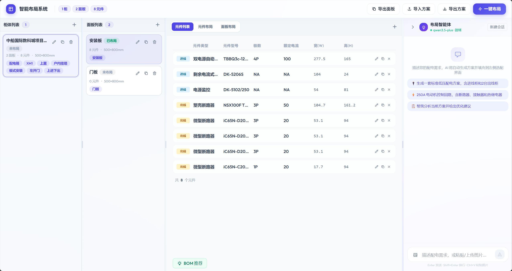
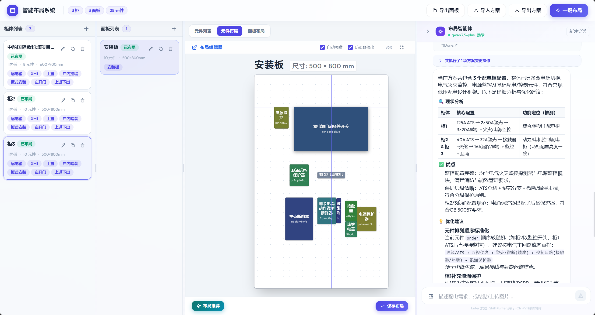
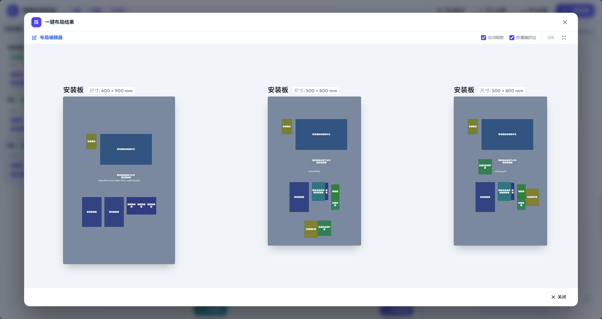
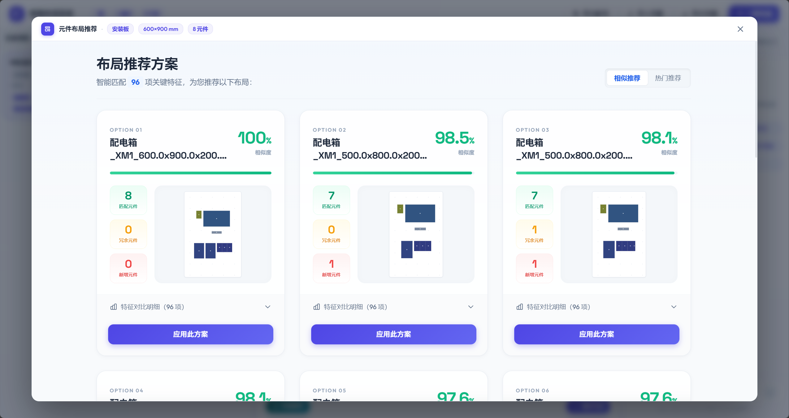
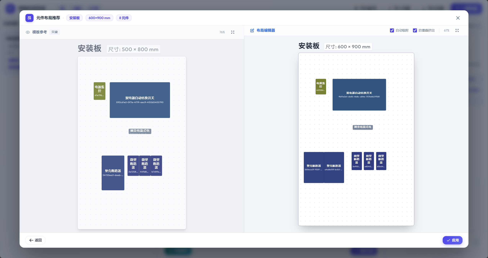

# 配电箱智能布局系统 - 产品侧完整流程说明

本文档系统化梳理了智能配电箱排版系统的工作流，为产品侧提供从参数录入、布局推荐到模板迁移与人工微调的全链路产品业务流程说明。

## 1. 参数录入与特征提取 (Parameter Entry)

系统通过结构化的表单收集当前项目配电箱的基础参数与 BOM（物料清单）信息。表单主要包括三个层级的录入项：

### 1.1 柜体参数 (Cabinet)

用于定义配电柜的全局业务与物理属性。

- **基础属性**：柜体名称、箱体分类（如：配电箱、户箱、电表箱等）、箱体系列（XM1、MZ、HW、DNB等）。
- **安装属性**：进线方式（上置、左置）、安装方式（户内暗装、户内挂墙、户外落地等）、固定方式（板式、梁式）、门型（左开、右开、双开）。
- **进出线方式**：上进下出、上进上出、下进下出等。
- **物理尺寸**：柜体的 宽 (W)、高 (H)、深 (D)。

### 1.2 面板参数 (Panel)

定义当前进行排版的承载面属性。

- **类型**：面板类型（如：安装板、门板）。
- **尺寸**：面板宽度、面板高度（系统默认标准尺寸如 500x800mm）。

### 1.3 元器件参数 (Components/Parts)

定义放置在面板上的具体电气元件。

- **业务信息**：进出线标记（是否为进线元件）、元件类型（塑壳断路器、接触器、微型断路器等）、元件型号、极数、额定电流。
- **物理尺寸**：元件个体的宽 (w)、高 (h)。

**特征提取机制 (Feature Extraction)：**
录入完毕后，系统不仅提取元件的长、宽、面积等几何数据，还会将“元器件总数”、“各类元件数量分布”以及前述的“箱体系列”、“安装方式”等纯业务分类属性转化为布尔值向量。这一组全面融合了物理与业务特征的数据将用于后续的精确匹配。

---

## 2. BOM 智能推荐与补全 (BOM Recommendation)

在进入正式的物理布局前，系统提供基于知识网络和图谱挖掘的物料清单（BOM）智能推荐能力，辅助工程师完善前期设计：

- **环境约束召回**：根据配电箱的基础物理和业务约束（如柜体尺寸、箱体系列、进线方式等），在历史库中寻找相似工况下的成熟 BOM 方案作为推荐基准。
- **图谱共现召回**：利用沉淀在系统知识网络中的元件组合规律，自动发掘并推荐常与当前已有元件高频“成对出现”的衍生或配套部件。
- **智能融合补全**：将上述多路召回结果进行融合与置信度计算，向工程师展示推荐补充的元件清单，有效降低漏配风险。

---

## 3. 智能配置助手 (AI Configurator Agent)

为了进一步降低参数录入和修改的门槛，系统在交互层引入了基于自然语言和大模型的智能配置助手（Agent）：

- **自然语言交互**：用户可直接通过对话的形式，一次性批量添加多个柜体、面板或元器件，也可指令系统对已有属性进行修改或删除，大幅减少繁琐的表单填报工作。
- **图纸智能识别**：当用户上传图纸或照片时，助手能够自动识别其中的配置信息、设备数量和规格参数，并一键生成对应的系统配置，对不确定的字段会主动询问用户确认。
- **上下文感知与智能推断**：助手实时感知用户当前在界面上的选中状态（如当前操作的面板或柜体）。当用户的指令中省略了目标或部分参数时，助手能根据上下文及行业规范进行合理的智能推断并自动补全，极大提升了设计效率。

---

## 4. 一键布局与批量排版 (One-Click Batch Layout)

在完成参数录入与物料确认后，如果项目涉及多个柜体和面板，系统提供了“一键布局”的全局自动化功能：

- **全局自动调度**：系统会自动遍历项目中所有尚未排版的柜体和面板，对元件信息完整、合规的面板发起静默的自动排版任务。
- **无感静默排版**：系统在后台自动为每个面板匹配最佳的专家模板，并瞬间完成坐标迁移和物理干涉消除，全程无需用户手动逐张面板发起推荐和应用。
- **状态追踪与跳过**：在批处理过程中，系统实时反馈每个面板的排版状态。对于缺少尺寸数据或未放置元件的面板，会自动跳过并给出明确的提示，方便工程师后续单独补充处理。

---

## 5. 布局推荐引擎 (Layout Recommendation)

在完成参数录入后，可按照面板进行智能布局推荐。

- **高维特征检索**：基于步骤 1 提取的综合特征向量，引擎在积累的历史专家方案库中执行检索。
- **差异度计算**：找出与当前新配电箱物理特征和业务约束最接近的历史方案（Templates）。
- **可视化呈现**：前端工作台会以列表形式展现推荐结果，包含历史模板缩略图、特征差异对比，并使用直观的色彩徽章（绿/黄/红）展示匹配评分。产品设计上，通过将最相关方案前置，辅助电气工程师快速确定设计的“参考基石”。

---

## 6. 模板迁移与智能排版 (Template Migration)

当工程师在推荐列表中选定某一个历史方案并点击“应用”后，系统的核心智能排版将接管工作。该过程分两个阶段实现高度自动化的设计迁移：

### 6.1 第一阶段：坐标映射与期望位置分配 (Coordinate Mapping)

算法按照优先级机制，为新配电箱中的**每一个**元器件分配一个“理想坐标”及对应的“置信权重”：

1. **主模板精确映射（高权重）**：按照元件类型和面积寻找主模板中的最佳对应元件，根据新旧面板尺寸的比例差异进行等比坐标转换。
2. **备选模板补位（中权重）**：针对主模板中不存在的新型元件，算法会自动去其他推荐的备选方案中“借用”同类型元件的成熟排版位置。
3. **同类型游标续排（智能追加）**：对于新项目中数量增加的元件，算法会定位同类型的元件簇作为“锚点”，自动沿锚点向右追加排布；遇到面板边缘则自动执行折行（换行）逻辑，甚至Y轴触底钳位。
4. **默认兜底（低权重）**：完全无历史参考的零散部件会被暂置于面板底部的安全区域。

### 6.2 第二阶段：约束规划与精确排布 (Constraint Solving)

拥有初始期望后，直接照搬可能导致元件重叠或溢出。系统通过严格的约束规划算法寻找合规的最优解：

- **硬性约束（不可违反）**：所有元件必须落在面板物理边界内，且满足设定的留白边距 (Margin)；元件之间绝对不允许发生重叠，且满足最小安全间距 (Gap)。
- **优化目标（审美保障）**：在满足上述前提下，尽可能让每个元件靠近其在第一阶段分配的“理想坐标”。算法中特意引入了 **Y 轴偏移惩罚 (Y-Penalty)**：当元件必须挪动以避免重叠时，系统更倾向于在水平方向（X轴）微调，强制保证同一行的元件在视觉上保持同一水平线，贴合严谨的工业审美要求。

---

## 7. 交互微调与输出闭环 (Manual Fine-tuning & Output)

自动化求解完成后，结果将被投射到前端的“双画板”工作区。

- **智能辅助交互**：工程师可通过拖拽对不甚满意的区域进行微调。前端系统内置了**自动吸附 (Auto Snap)** 辅助线（边缘对齐、中心线对齐），提升微调精度。
- **动态防重叠挤出 (Auto Extrude)**：在开启防护模式时，如果拖拽的元件与现有元件冲突，前端排挤算法会自动按最短路径将周围元件“推开”，杜绝人为操作导致的物理干涉。
- **数据闭环与输出**：确认无误提交后，系统不仅输出携带精确坐标 (X,Y) 与旋转角度的结构化数据供下游生产线（如 SuperBox 系统）使用，同时还会记录**方案采纳率**，上报该次操作中推荐了哪些方案以及用户最终选用了哪个方案。此数据闭环为后期推荐算法的学习迭代以及产品数据指标统计奠定基础。
