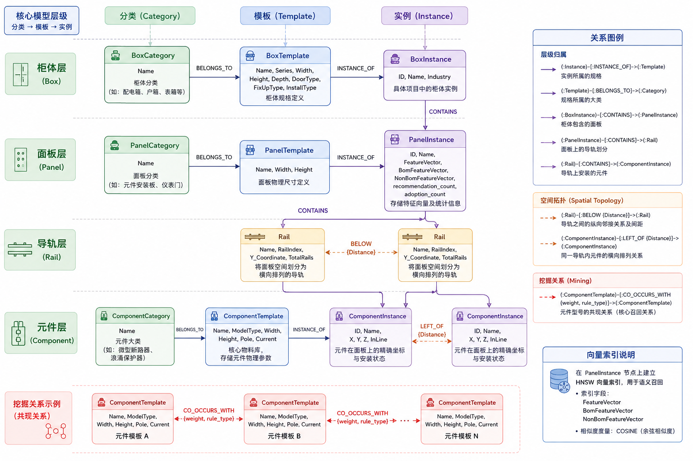
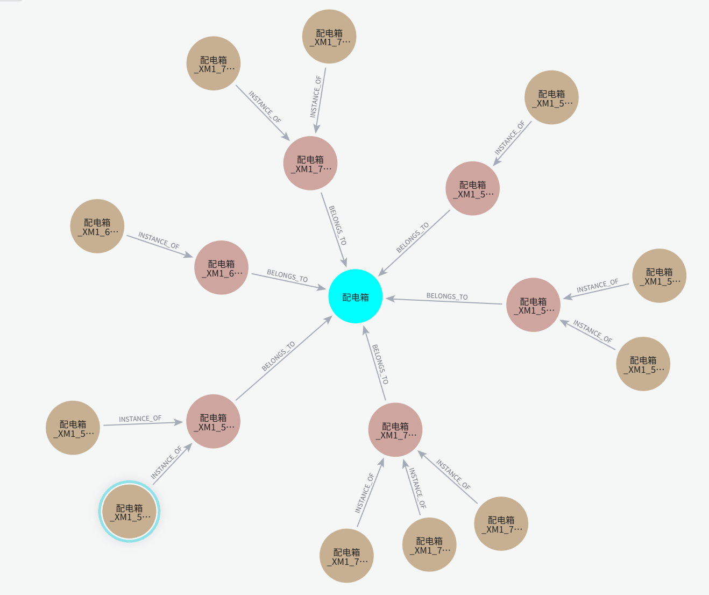
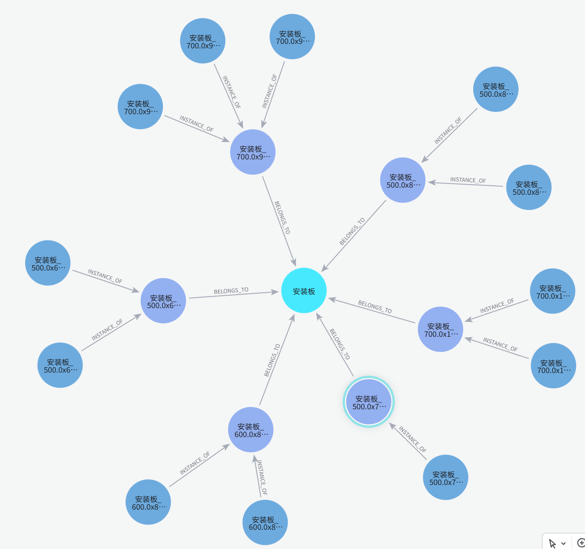
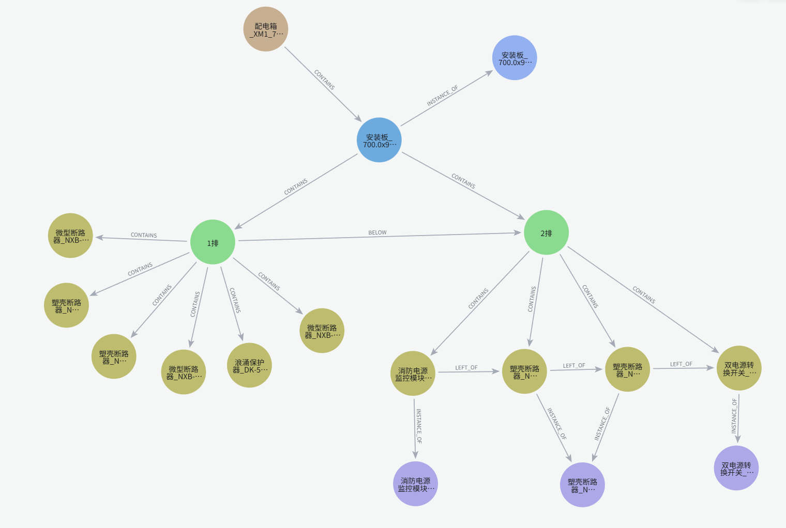
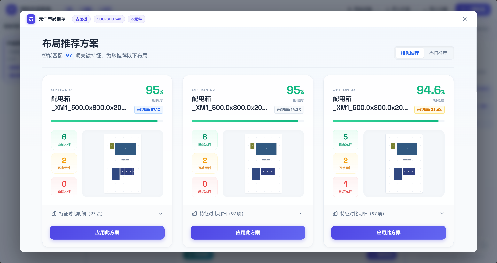
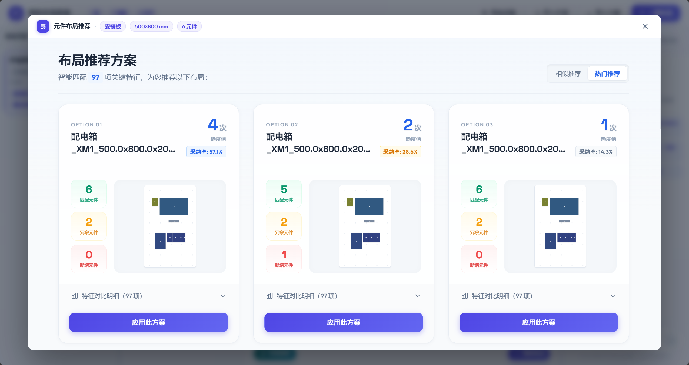
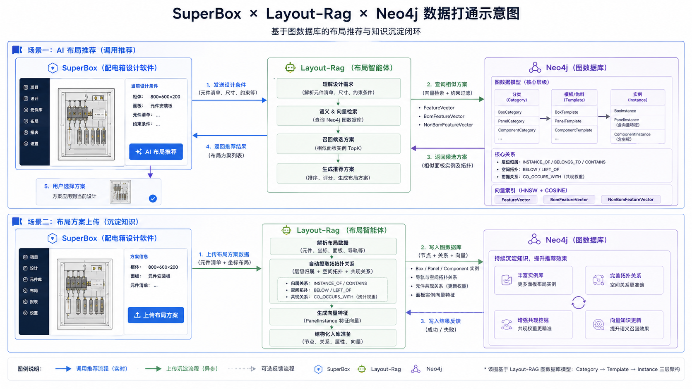

# Layout-RAG

## 一、 图数据库改造 (Neo4j Graph Schema)

### 架构演进：从“分离”走向“统一”

在系统迭代早期，采用了 **“关系型数据库 (MySQL) + 专门向量数据库 (Milvus)”** 的分离架构。虽然解决了基本的存储与搜索问题，但在工业布局场景下遇到了核心挑战：

- **拓扑表达缺失**：关系型数据库难以高效表达元件之间的“左邻右舍”和“层级包含”等复杂物理拓扑。
- **数据一致性痛点**：元数据与向量特征存储在两个系统中，入库与更新时的事务一致性难以保障。
- **查询链路长**：每次推荐需要跨库进行多次查询和特征对比，响应延迟高。

**本次改造全面迁移至 Neo4j 6.x 图原生数据库：**

- **全要素统一存储**：将柜体规格、面板拓扑、元件 BOM 以及高维特征向量全部整合进 Neo4j 的 Property Graph 模型中。
- **图向量混合索引**：利用 Neo4j 原生的 HNSW 向量索引，实现了“在特定图约束下进行向量搜索”的能力（例如：仅在指定柜体系列内搜索相似面板）。
- **知识白盒化**：通过图算法直接在数据库内沉淀元件共现关系，将原来深藏在向量空间的“黑盒特征”转化为直观的图谱关系。

### 图结构

### 1. 核心模型层级

系统采用“分类 -> 模板 -> 实例”的三层解耦架构：

- **Category (分类)**: 业务大类（如：配电箱、断路器）。
- **Template (模板/物料)**: 具体的物料规格（如：型号、物理尺寸、极数等）。
- **Instance (实例)**: 在具体工程项目中的应用（包含坐标位置、向量指纹等）。

---

### 2. 节点定义 (Nodes)

#### 2.1 柜体层 (Box)

| 标签 | 属性 | 说明 |
| :--- | :--- | :--- |
| **BoxCategory** | `Name` | 柜体分类（如：配电箱、户箱、表箱等） |
| **BoxTemplate** | `Name`, `Series`, `Width`, `Height`, `Depth`, `DoorType`, `FixUpType`, `InstallType` | 柜体规格定义 |
| **BoxInstance** | `ID`, `Name`, `Industry` | 具体项目中的柜体实例 |

#### 2.2 面板层 (Panel)

| 标签 | 属性 | 说明 |
| :--- | :--- | :--- |
| **PanelCategory** | `Name` | 面板分类（如：元件安装板、仪表门） |
| **PanelTemplate** | `Name`, `Width`, `Height` | 面板物理尺寸定义 |
| **PanelInstance** | `ID`, `Name`, `FeatureVector`, `BomFeatureVector`, `NonBomFeatureVector`, `recommendation_count`, `adoption_count` | 存储了用于 RAG 检索的特征向量及统计信息 |

#### 2.3 导轨层 (Rail)

| 标签 | 属性 | 说明 |
| :--- | :--- | :--- |
| **Rail** | `Name`, `RailIndex`, `Y_Coordinate`, `TotalRails` | 将面板空间划分为横向排列的导轨 |

#### 2.4 元件层 (Component)

| 标签 | 属性 | 说明 |
| :--- | :--- | :--- |
| **ComponentCategory** | `Name` | 元件大类（如：微型断路器、浪涌保护器） |
| **ComponentTemplate** | `Name`, `ModelType`, `Width`, `Height`, `Pole`, `Current` | 核心物料库，存储元件物理参数 |
| **ComponentInstance** | `ID`, `Name`, `X`, `Y`, `Z`, `InLine` | 元件在面板上的精确坐标与安装状态 |

---

### 3. 关系定义 (Relationships)

#### 3.1 层级归属

- `(Instance)-[:INSTANCE_OF]->(Template)`: 实例所属的规格。
- `(Template)-[:BELONGS_TO]->(Category)`: 规格所属的大类。
- `(BoxInstance)-[:CONTAINS]->(PanelInstance)`: 柜体包含的面板。
- `(PanelInstance)-[:CONTAINS]->(Rail)`: 面板上的导轨划分。
- `(Rail)-[:CONTAINS]->(ComponentInstance)`: 导轨上安装的元件。

#### 3.2 空间拓扑 (Spatial Topology)

- `(Rail)-[:BELOW {Distance}]->(Rail)`: 导轨之间的纵向邻接关系及间距。
- `(ComponentInstance)-[:LEFT_OF {Distance}]->(ComponentInstance)`: 同一导轨内元件的横向排列关系。

#### 3.3 挖掘关系 (Mining)

- `(ComponentTemplate)-[:CO_OCCURS_WITH {weight, rule_type}]->(ComponentTemplate)`:
  **核心召回关系**。表示两个型号的元件经常出现在同一个面板中。`weight` 代表共现频次。

---

### 4. 向量索引说明

系统在 `PanelInstance` 的特征属性上建立了 **HNSW 向量索引**，用于实现语义召回。

- 索引字段：`FeatureVector`, `BomFeatureVector`, `NonBomFeatureVector`
- 相似度度量：`EUCLIDEAN` (欧氏距离)

## 二、 智能布局系统改进

### 1. BOM 推荐模块

基于图向量检索与知识图谱挖掘，系统实现了**多路召回 + 置信度融合**的智能 BOM 补全：

- **环境召回 (Environment Recall)**：基于箱体尺寸、系列、进线方式等非 BOM 特征，召回在类似物理约束下的历史配置。
- **BOM 召回 (BOM Recall)**：基于当前部分元件的分布指纹，寻找物料构成最相似的成熟方案。
- **图谱共现召回 (Graph Recall)**：利用 Neo4j 中的 `CO_OCCURS_WITH` 关系，挖掘历史数据中与当前元件高频“成对出现”的邻居部件（如：断路器与辅助触头的固定搭配）。
- **互补过滤逻辑**：系统自动识别当前缺失的大类，根据加权分数（Env:0.3, Bom:0.4, Graph:0.3）计算综合置信度，精准推荐缺失型号。

### 2. 方案采纳率

系统内置了自动化的**业务反馈闭环**：

- **自动计数**：每当一个布局方案在推荐列表中展示，其 `recommendation_count` 自动加 1；当用户点击“应用”并确认，其 `adoption_count` 自动加 1。
- **质量衡量**：通过“采纳/推荐”的比值，系统可以实时感知每个历史模板在实际业务中的受欢迎程度和质量得分，为后续的精排逻辑提供数据支撑。

### 3. 热门方案推荐

除了单纯的几何相似度，系统引入了**热度排序维度**：

- **高频优先**：在召回结果相似度相近时，系统会优先推送 `adoption_count` 较高的“明星方案”。
- **进化学习**：随着 SuperBox 用户的使用，图数据库中的统计数据会不断动态刷新，实现“用的越多、推的越准”的正向循环。

## 三、 SuperBox 智能布局

### 1. electron-app

使用 Electron 框架将布局算法封装为轻量级桌面工具：

- **跨平台桥梁**：作为 SuperBox 插件与 Python 后端服务的中间层，处理数据封包与可视化展示。
- **零配置启动**：通过 `build_electron.bat` 一键打包，方便集成到现有的工业设计环境。

### 2. AI 方案推荐与迁移

- **RAG 语义检索**：将 SuperBox 的物料清单与柜体属性作为 Query，在图数据库中进行向量检索，秒级返回最匹配的布局参考。
- **布局平移优化**：应用方案时，并非简单的坐标复制，而是调用 **OR-Tools CP-SAT 求解器**。以历史方案为“约束骨架”，在满足当前 SuperBox 实际柜体尺寸约束下，自动计算不重叠、边距最优的新坐标，实现布局的智能迁移。

### 3. 布局方案上传

- **经验沉淀**：用户在 SuperBox 中微调完成的最终布局，可通过一键上传接口回传。
- **自动特征化**：后端 `PLMGraphImporter` 会自动提取该方案的几何特征、拓扑关系并重新计算向量指纹，将其作为新的“经验节点”沉淀到 Neo4j 知识图谱中，完成知识的自动化积累。

