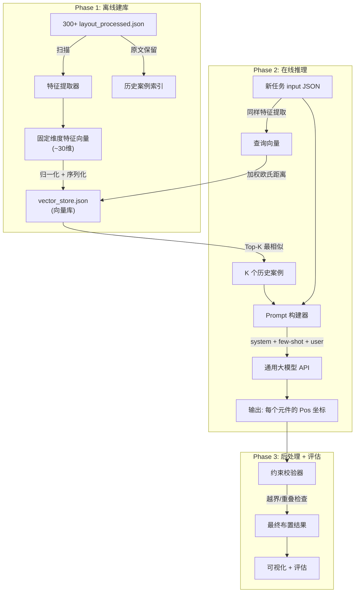
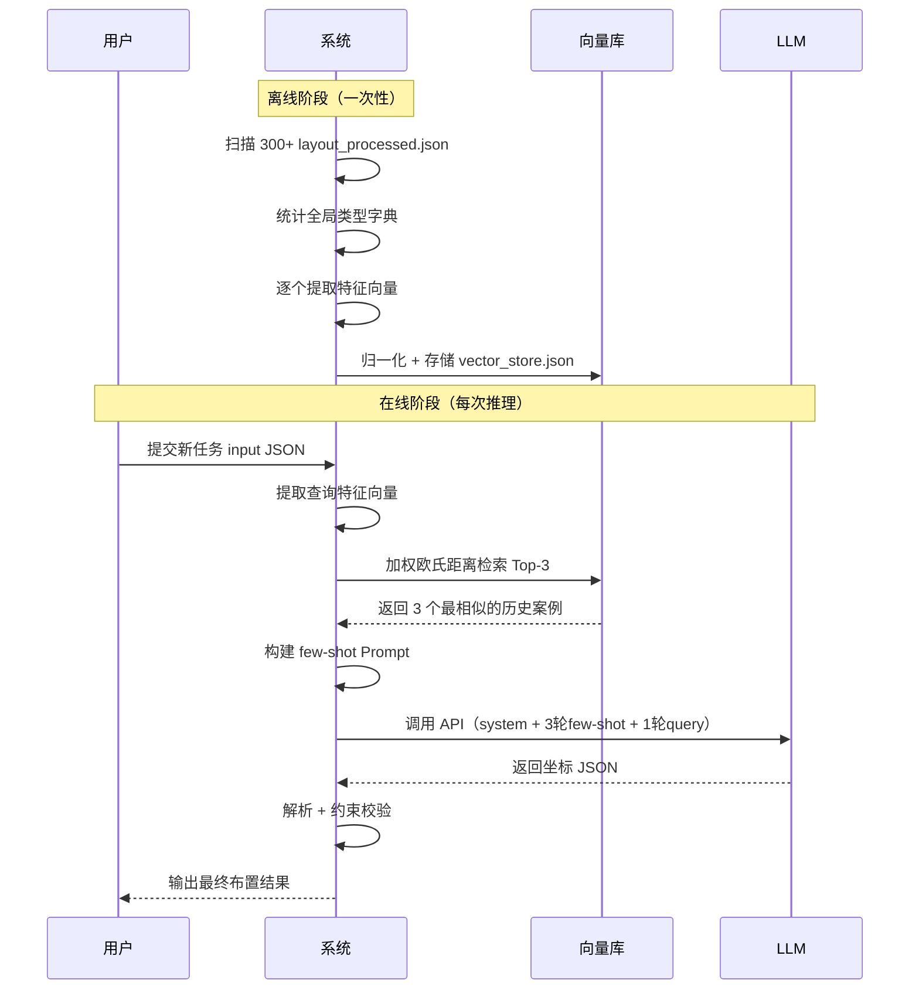

# 元件智能布置系统 — 完整实施方案

## 背景

从 300+ 份历史布置数据（[layout_processed.json](file:///d:/Documents/Code/ai/ai-layout/data/box/2024030507%E5%8C%97%E4%BA%AC%E5%B8%82%E6%88%BF%E5%B1%B1%E5%8C%BA%E9%98%8E%E6%9D%91%E9%95%8704%E8%A1%97%E5%8C%BA%E9%A1%B9%E7%9B%AE%E4%BD%93%E8%82%B2%E7%94%A8%E6%88%BF%E9%A1%B9%E7%9B%AE-%E7%AC%AC%E4%BA%8C%E6%89%B9%E9%9D%9E%E6%A0%87/2cdb7dd4/layout_processed.json)）中提取特征向量，当用户输入新任务时通过相似度检索找到最相似的历史案例，以 few-shot 方式调用通用大模型，让大模型直接输出每个元件的精确坐标。

---

## 系统架构



---

## 模块设计

### 模块 1: 特征提取器 `feature_extractor.py`

#### 输入

一个 [layout_processed.json](file:///d:/Documents/Code/ai/ai-layout/data/box/2024030507%E5%8C%97%E4%BA%AC%E5%B8%82%E6%88%BF%E5%B1%B1%E5%8C%BA%E9%98%8E%E6%9D%91%E9%95%8704%E8%A1%97%E5%8C%BA%E9%A1%B9%E7%9B%AE%E4%BD%93%E8%82%B2%E7%94%A8%E6%88%BF%E9%A1%B9%E7%9B%AE-%E7%AC%AC%E4%BA%8C%E6%89%B9%E9%9D%9E%E6%A0%87/2cdb7dd4/layout_processed.json) 的 `input` 部分：

```json
{
  "PanelType": "安装板",
  "PanelSize": [600.0, 1000.0],
  "Parts": [
    {"ID": "xxx", "Type": "微型断路器", "Size": [63.0, 145.6]},
    ...
  ]
}
```

#### 特征向量定义（固定维度）

将每个任务编码为 **固定长度** 的特征向量，分 4 类共约 30 维：

| 类别 | 特征名 | 维度 | 计算方式 |
|------|--------|------|---------|
| **面板** | panel_width | 1 | PanelSize[0] |
| | panel_height | 1 | PanelSize[1] |
| | panel_area | 1 | width * height |
| | panel_aspect_ratio | 1 | width / height |
| **元件统计** | total_parts | 1 | len(Parts) |
| | unique_types | 1 | len(set(types)) |
| | total_parts_area | 1 | sum(w*h for each part) |
| | fill_ratio | 1 | total_parts_area / panel_area |
| | avg_part_width | 1 | mean(widths) |
| | avg_part_height | 1 | mean(heights) |
| | max_part_width | 1 | max(widths) |
| | max_part_height | 1 | max(heights) |
| | width_std | 1 | std(widths) |
| | height_std | 1 | std(heights) |
| **类型分布** | count_微型断路器 | 1 | 该类型元件数量 |
| | count_塑壳断路器 | 1 | 同上 |
| | count_继电器+接线端子 | 1 | 同上 |
| | ... (所有已知类型) | ~15 | 每种类型一个维度 |
| **结构特征** | has_双电源 | 1 | 0 或 1 |
| | has_地排 | 1 | 0 或 1 |
| | has_零排 | 1 | 0 或 1 |
| | large_part_ratio | 1 | 面积>10000mm² 的元件占比 |

> [!IMPORTANT]
> 类型列表需要从全量 300+ 数据中预先统计得到一个**全局类型字典**，确保所有样本使用同一套类型维度。新增类型时需重建向量库。

#### 输出

```python
{
    "id": "项目名/哈希ID",
    "source_path": "data/box/.../layout_processed.json",
    "vector": [600.0, 1000.0, 600000.0, 0.6, 15, 6, ...],  # 固定长度
    "feature_names": ["panel_width", "panel_height", ...]     # 特征名列表（全局一致）
}
```

---

### 模块 2: 向量库与检索器 `vector_store.py`

#### 存储格式 `vector_store.json`

```json
{
    "version": 1,
    "feature_names": ["panel_width", "panel_height", ...],
    "normalization": {
        "method": "min_max",
        "min_vals": [400, 800, ...],
        "max_vals": [1000, 2400, ...]
    },
    "weights": {
        "panel_width": 2.0,
        "panel_height": 2.0,
        "total_parts": 3.0,
        "fill_ratio": 2.0,
        "count_微型断路器": 2.5,
        "count_塑壳断路器": 2.5,
        "_default": 1.0
    },
    "entries": [
        {
            "id": "项目名/2cdb7dd4",
            "source_path": "data/box/.../layout_processed.json",
            "raw_vector": [800, 2200, ...],
            "normalized_vector": [0.67, 0.88, ...]
        },
        ...
    ]
}
```

#### 检索算法：加权欧氏距离

```
distance(a, b) = sqrt( sum( w_i * (a_i - b_i)^2 ) )
```

其中 `w_i` 是每个特征维度的权重。权重设计思路：

| 权重等级 | 值 | 适用特征 | 理由 |
|---------|-----|---------|------|
| 最高 | 3.0 | total_parts, 各类型Count | 元件组合是布局的核心决定因素 |
| 高 | 2.0-2.5 | panel_width, panel_height, fill_ratio | 面板大小直接影响布局策略 |
| 中 | 1.0 | 统计量（avg, max, std） | 辅助区分 |
| 低 | 0.5 | has_xxx 布尔标志 | 粗粒度特征 |

#### 检索流程

1. 提取查询向量
2. 用向量库的 min/max 参数归一化
3. 计算与所有条目的加权欧氏距离
4. 返回 Top-K（默认 K=3）
5. 如果 Top-1 距离超过阈值，附加警告标记

> [!NOTE]
> 300+ 条数据不需要 FAISS 等向量数据库，纯 numpy 暴力搜索足够快（< 1ms）。当数据增长到数万级别时再考虑引入近似最近邻。

---

### 模块 3: Prompt 构建与 LLM 推理 `inference.py`

#### Prompt 结构

```
[System] 
你是一个专业的电气布局设计专家。给定配电箱面板尺寸和待布局的元器件清单，
输出每个元器件的精确坐标位置（Pos），单位为毫米（mm）。

规则:
1. 所有坐标为元件左上角的 (x, y) 绝对坐标
2. 坐标必须在面板范围内：0 ≤ x + width ≤ PanelSize[0]，0 ≤ y + height ≤ PanelSize[1]
3. 任意两个元件不得重叠
4. 按空间顺序输出（从上到下，从左到右）
5. 仅输出 JSON 数组，不要任何其他文字

[User: few-shot 示例 1 — 检索到的最相似案例]
{input 的 JSON}

[Assistant: few-shot 示例 1 对应输出]
{output 的 JSON 数组}

[User: few-shot 示例 2]
...

[User: 当前实际查询]
{新任务的 input JSON}
```

#### 坐标精度策略

> [!WARNING]
> 直接让大模型输出高精度浮点坐标（如 `437.8710082867183`）是一个挑战。大模型擅长语义推理，但在精确数值计算上容易"编造"数字。

**推荐分级策略：**

| 层级 | 精度 | 做法 | 效果 |
|------|------|------|------|
| **方案A: 圆整坐标** | 整数 mm | 历史数据的 Pos 四舍五入到整数后喂给 LLM，输出也是整数 | 最简单，token 消耗少，误差 < 1mm |
| **方案B: 保留1位小数** | 0.1mm | Pos 保留一位小数 | 精度够用，token 适中 |
| 方案C: 原始精度 | 高精度浮点 | 直接用原始数据 | token 消耗极大且 LLM 倾向于全部编造 |

> [!IMPORTANT]
> **强烈建议方案 A 或 B。** 配电箱元件布置的物理精度要求通常在 mm 级，整数精度完全满足工程需求。高精度浮点数只会浪费 token 并降低 LLM 准确率。

#### few-shot 示例的预处理

```python
def prepare_example(layout_json: dict, precision: int = 0) -> tuple[str, str]:
    """将历史案例转为 few-shot 的 user/assistant 对"""
    input_data = layout_json["input"]
    output_data = layout_json["output"]
    
    # 圆整坐标
    for item in output_data:
        item["Pos"] = [round(v, precision) for v in item["Pos"]]
    
    # 圆整元件尺寸
    for part in input_data["Parts"]:
        part["Size"] = [round(v, precision) for v in part["Size"]]
    
    user_msg = json.dumps(input_data, ensure_ascii=False)
    assistant_msg = json.dumps(output_data, ensure_ascii=False)
    return user_msg, assistant_msg
```

---

### 模块 4: 后处理与评估 [post_process.py](file:///d:/Documents/Code/ai/ai-layout/tools/post_process.py) / [evaluate.py](file:///d:/Documents/Code/ai/ai-layout/tools/evaluate.py)

#### 后处理

1. **解析 LLM 输出的 JSON**（容错处理 markdown code block 等）
2. **约束校验**：
   - 越界检查：`x >= 0`, `y >= 0`, `x + w <= panel_w`, `y + h <= panel_h`
   - 重叠检查：任意两元件的 AABB 不相交
   - 完整性检查：输出包含所有输入元件 ID
3. **违规修复**（可选后续迭代）：
   - 轻微越界 → 吸附到边界
   - 轻微重叠 → 微调推开

#### 评估指标

| 指标 | 计算方式 | 意义 |
|------|---------|------|
| 越界率 | 越界元件数 / 总元件数 | 越低越好 |
| 重叠率 | 重叠对数 / 总对数 | 越低越好 |
| 完整率 | 输出元件数 / 输入元件数 | 应为 100% |
| 位置偏差 | mean(每个元件与标准答案的欧氏距离) | 越低越好 |
| 布局相似度 | 1 - normalized_position_error | 0~1，越高越好 |

---

## 项目目录结构（重构后）

```
ai-layout/
├── data/
│   └── box/                        # 原始历史数据（不动）
│       └── 项目名/hash/layout_processed.json
├── config/
│   ├── type_dict.json              # 全局元件类型字典
│   └── weights.json                # 特征权重配置
├── core/
│   ├── feature_extractor.py        # 模块1: 特征提取
│   ├── vector_store.py             # 模块2: 向量库与检索
│   ├── inference.py                # 模块3: Prompt + LLM 调用
│   ├── post_process.py             # 模块4: 输出解析 + 约束校验
│   └── evaluate.py                 # 模块4: 评估
├── scripts/
│   ├── build_vector_store.py       # 一键建库脚本
│   ├── run_inference.py            # 推理入口
│   └── run_evaluation.py           # 批量评估脚本
├── output/
│   ├── vector_store.json           # 生成的向量库
│   └── results/                    # 推理结果
└── tools/
    └── visualize.py                # 可视化工具
```

---

## 完整工作流



---

## 实施计划

### 阶段 1: 基础建设

- [ ] 扫描全量数据，建立全局元件类型字典
- [ ] 实现 `feature_extractor.py`
- [ ] 实现 `vector_store.py`（含建库 + 检索）
- [ ] 编写 `build_vector_store.py` 一键建库脚本

### 阶段 2: 推理管线

- [ ] 实现 `inference.py`（Prompt 构建 + LLM 调用）
- [ ] 实现 [post_process.py](file:///d:/Documents/Code/ai/ai-layout/tools/post_process.py)（输出解析 + 约束校验）
- [ ] 编写 `run_inference.py` 推理入口

### 阶段 3: 评估优化

- [ ] 实现 [evaluate.py](file:///d:/Documents/Code/ai/ai-layout/tools/evaluate.py)（评估指标计算）
- [ ] 编写 `run_evaluation.py` 批量评估脚本
- [ ] 调整权重和参数

### 阶段 4: 可视化与集成

- [ ] 适配可视化工具
- [ ] 集成到现有工作流

---

## User Review Required

> [!IMPORTANT]
> **坐标精度决策**：方案 A（整数mm）还是方案 B（1位小数）？建议方案 A，理由是 LLM 对整数更精确、token 更省、工程精度足够。

> [!IMPORTANT]
> **few-shot 数量**：推荐 Top-3，但也可以 Top-1（节省 token）或 Top-5（更多参考但 prompt 更长）。具体选几个？

> [!IMPORTANT]
> **你打算用哪个大模型 API？** 需要确定后才能实现 `inference.py` 中的调用逻辑。

## Verification Plan

### Automated Tests

1. **特征提取一致性测试**：对同一个 JSON 文件两次提取特征，结果应完全一致
2. **向量库建库测试**：建库后条目数应与源文件数一致
3. **检索正确性测试**：用已有样本作为查询，Top-1 应该是自身（距离为 0）
4. **端到端 smoke test**：随机取一个历史案例作为输入，完整跑一遍 pipeline，检查输出格式是否正确

### Manual Verification

1. 选取 5-10 个测试案例，运行推理后用可视化工具对比 LLM 输出与历史标准答案
2. 检查约束校验器是否正确检测出越界和重叠
